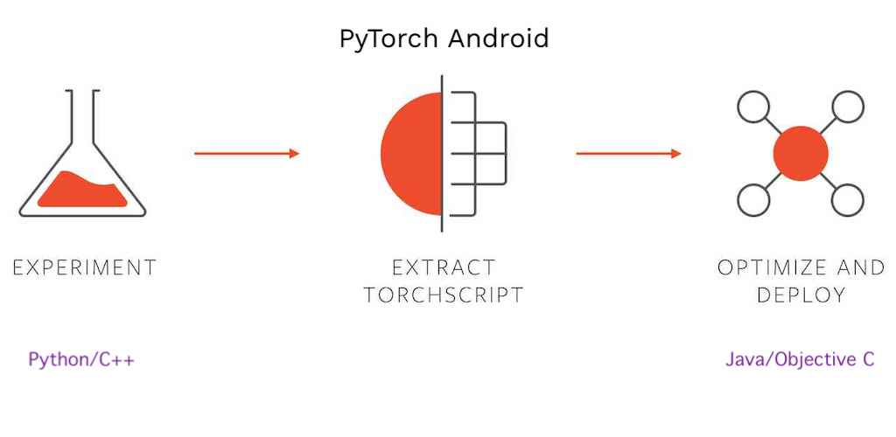

<h1 align="center">
 
</h1>
<p align="center">
 Android application with collection of machine learning experiments using PyTorch Android API
 <br />
 <br />
 
 
</p>

<!-- Table of Contents !-->
* [About PyTorch Mobile](#about-pytorch-mobile)
* [What is TorchExpo?](#what-is-torchexpo?)
* [Getting Started](#getting-started)
  * [Prerequisites](#prerequisites)
  * [Installation](#installation)
* [Contributing](#contributing)
* [License](#license)

## About PyTorch Mobile
PyTorch Mobile is an experiment release that provides APIs to build an end-to-end workflow
from Python to deployment on iOS and Android. _[Read more](https://pytorch.org/mobile/home/)_

<p align="center">
	
</p>

### PyTorch Android API
PyTorch Mobile provides Java APIs for integration of Machine Learning models built with Python
into an Android application. It is as simple as importing and using any other Android library. You
can add PyTorch's Gradle dependencies and can run inferences.
_[Read more](https://pytorch.org/mobile/android/)_

## What is TorchExpo?
TorchExpo is an android application which contains collection of machine learning experiments
built using PyTorch and its Android API. This application will allow you to try tasks like Image
Classification with State-Of-The-Art models _(like AlexNet, ResNet, etc.)_.

### Built With
* [PyTorch](https://pytorch.org)
* [PyTorch Android API](https://pytorch.org/mobile/android/)
* [Android Ecosystem](https://developer.android.com)

## Getting Started

### Prerequisites
* [Python 3](https://www.python.org/download/releases/3.0/)
* [Java 1.8](https://www.java.com/en/download/)
* [Android Studio](https://developer.android.com/studio)

### Installation
* Git clone this/forked repository
```shell script
git clone git@github.com:prabhuomkar/TorchExpo.git
OR
git clone git@github.com:<GITHUB_USERNAME>/TorchExpo.git
```
* For Android Stuff:
  * Open this project with **Android Studio**
  * Build the project by installing Gradle dependencies
* For Machine Learning Stuff:
  * Install the Python dependencies:
    ```shell script
    cd models
    pip install -r requirements.txt
    ```

## Contributing
We appreciate all contributions. If you are planning to contribute back bug-fixes, please do so
without any further discussion.

If you plan to contribute new features, utility functions or any application upgrades, please first
open an issue and discuss the feature with us. Sending a PR without discussion might end up
resulting in a rejected PR, because we might be taking the project in a different direction
than you might be aware of.

Please refer our [Contribution Guide](https://prabhuomkar.github.io/TorchExpo/#/contributing) for more details.

## License
This project is licensed under Apache-2.0 as given in [LICENSE](LICENSE) file.